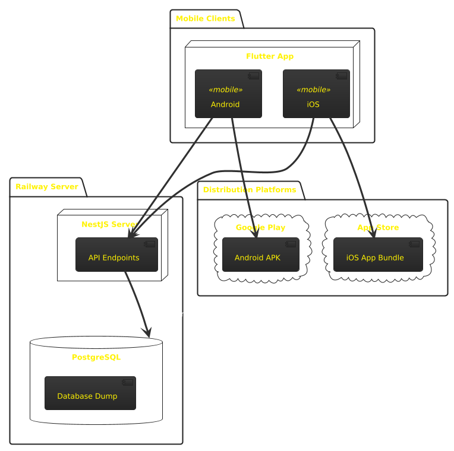

# User roles

### Regular

Has basic features

### Premium

Has ability to use tags

### Guest

Can only search public collections and bookmarks

# Data objects

### User

Holds username, name, role, email. Can

### Tags

Tags that are created by the user. Holds a string value, color and optional icon

### Bookmarks

Bookmarks are links for now. It only holds the link value + metadata such as when shared, title, description, author, etc. Basically stuff for searching the bookmarks easily

### Social Apps

An app is basically a collection, but is predefined.

### Collection

A collection is a group of bookmarks in it's most basic form.

### Collection item

Holds bookmark id and collection id.

main runway decade horror favorite frozen begin design document kingdom predict auction

# Requirements

### Authentication

- Auth0 integration with JWT authentication
- Three roles: Regular (basic features), Premium (tags enabled), Guest (public content only)

### Bookmarks

- Create, edit, delete bookmarks with URLs
- Auto-fetch metadata (title, description, image)
- Organize into collections
- Optional tagging (Premium only)
- Social app detection and grouping

### Collections

- Create, edit, delete collections
- Show bookmark count and preview images
- Public/private sharing options
- Guest access limited to public collections

### Premium features

- Tag management with custom colors and icons
- Tag assignment to bookmarks

### Search

- Search bookmarks, collections, and users
- Guests limited to public content search

# Tech stack

### Backend

- Framework: NestJS
- Language: TypeScript
- Database: PostgreSQL

### Frontend

- Framework: Flutter
- Language: Dart

### Other providers

- Server provider: Railway.app
- Auth provider: Auth0

# Wireframes

[Figma link](https://www.figma.com/design/aLN6EUvvwk1CG9mQ6co3Nc/Untitled?node-id=0-1&t=JOdLs6bosGI6lIHh-1)

# Deployment diagram

# API documentation

[API docs](https://bookmark-be-production.up.railway.app/api)

# Conclusion

This project demonstrated the effectiveness of combining a robust backend with a user-friendly frontend. Auth0 enabled efficient social login integration, enhancing security. Railway.app facilitated swift deployment, ensuring scalability. The Forui component library helped maintain design consistency, supporting user-centric design and modern development practices.
